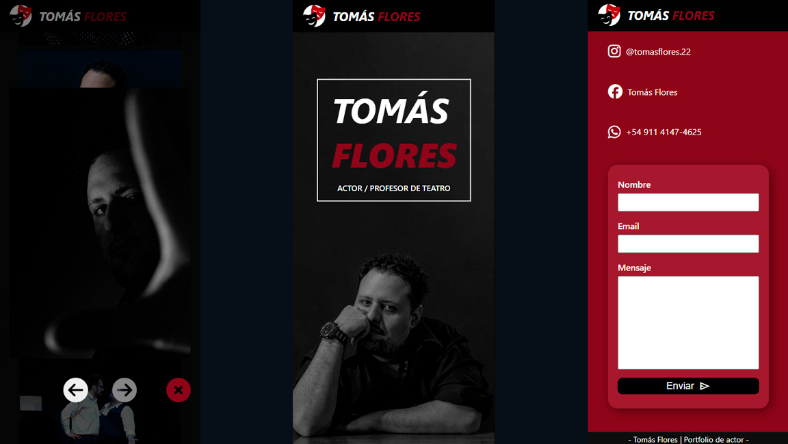

#  Portfolio de Actor - Proyecto Web


Este repositorio contiene el ***portfolio de Tomas Flores***, actor apasionado por el arte escénico.<br>
El sitio web fue diseñado para destacar su trayectoria artística, formación y proyectos, priorizando un diseño moderno, profesional y completamente responsive, con el objetivo de optimizar su presencia digital. 

🔗 **Visita el sitio online:**  
  [tomasrome.github.io/Tomas-Flores-Actor-Portfolio](https://tomasrome.github.io/Tomas-Flores-Actor-Portfolio/)

---

## Capturas de pantalla 📷

|  |  |
| ---- | ---- |
|  |  |

##  Características

-  **Diseño responsive**, adaptable a móviles, tablets y desktop.  
-  Estilo visual moderno y minimalista.  
-  Secciones con presentación, trayectoria y galería.  
-  Deploy en **GitHub Pages**.  

---

##  Tecnologías utilizadas  

-   
-   
-   
-   
 

---

##  Cómo ejecutarlo en local

1. Clona este repositorio:  

   ```bash
   git clone https://github.com/tomasrome/Tomas-Flores-Actor-Portfolio.git
